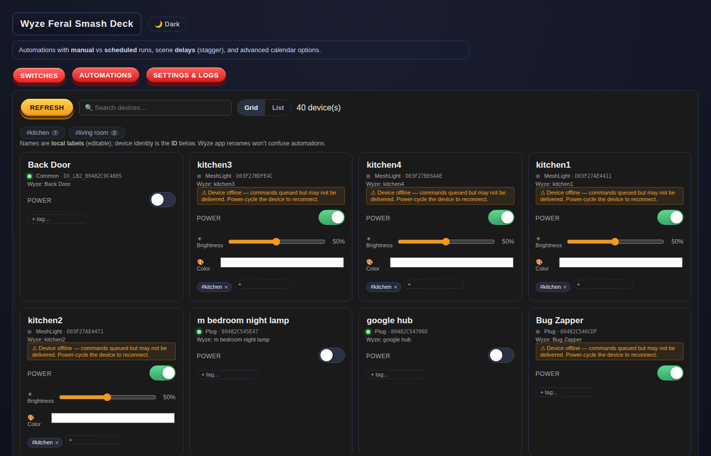
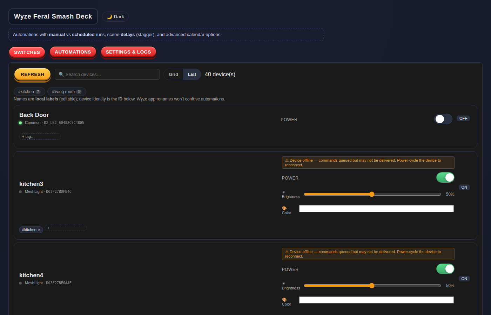
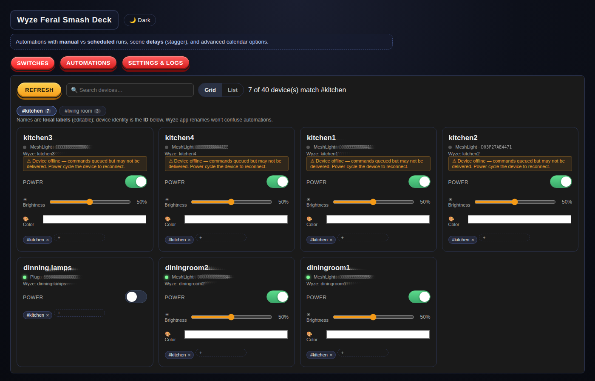
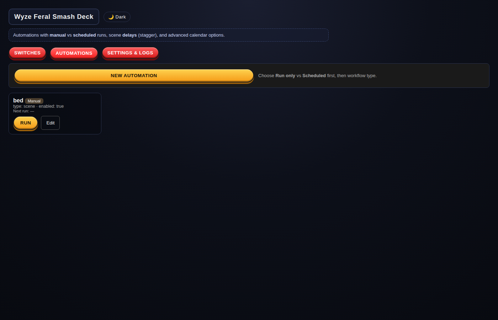
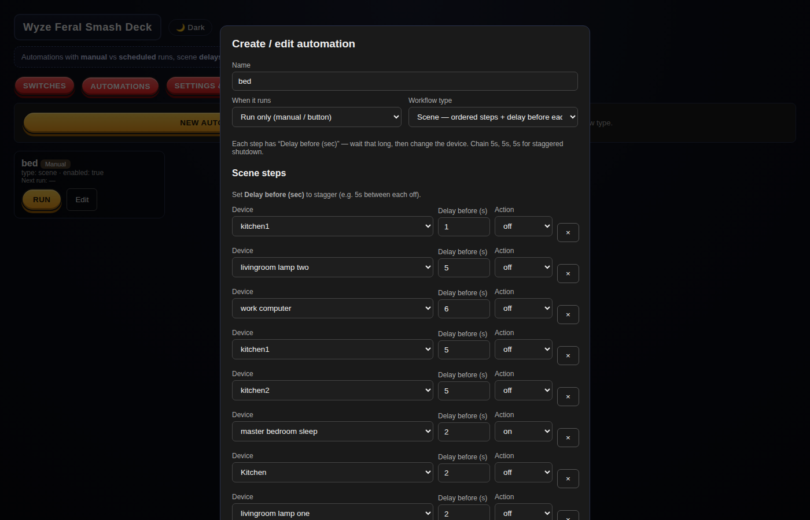
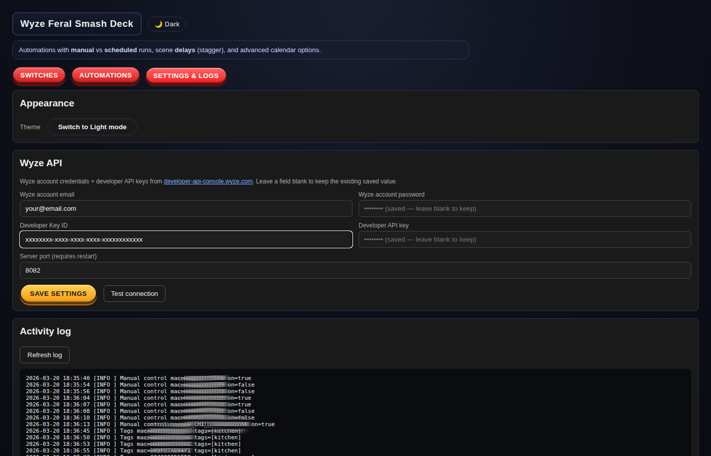

# Wyze Smash Deck

A self-hosted web dashboard for controlling Wyze smart home devices directly via the Wyze cloud API — no Home Assistant required.

## Why This Exists

I wanted a fast, local way to control my own Wyze devices.  While looking into it, I found some community plugins for Home Assistant that reverse-engineered the Wyze cloud API.  I used those same API calls — the same authentication flow, device endpoints, and property IDs — to build this dashboard independently.  It talks directly to Wyze's cloud (`auth-prod.api.wyze.com` and `api.wyzecam.com`) using your developer credentials.

---

## Screenshots

### Device Grid
All your Wyze devices in a compact grid with power toggles, brightness sliders, color pickers, and editable tags.



### Device List
Switch to a row-based list view for a denser overview.



### Tag Filtering
Click any tag chip in the filter bar to narrow the view to just those devices.



### Automations
Run manual scenes or schedule recurring automations across any combination of devices.



### Automation Editor
Build multi-step scenes with per-step delay, device selection, and actions (on / off / toggle / set color / set brightness).



### Settings
Configure Wyze credentials and API keys. Sensitive fields are masked after saving.



---

## Feature Overview

### Device Control
- **On / Off / Toggle** — instant power control for plugs, bulbs, and switches.
- **Brightness** — slider for dimmable mesh bulbs (1–100%).
- **Color** — native color picker for color-capable bulbs (Wyze Mesh `HL_BR30C`, `HL_A19C`, etc.). Sends the exact hex value directly to the device via property `P1507`.
- **Inline device rename** — click any device name to edit it locally. Renames are stored in the dashboard and never touch the Wyze cloud, so automations stay stable.

### Device Organization
- **Search** — real-time text search across device names and tags.
- **Tags** — attach one or more free-text tags to any device (e.g. `#kitchen`, `#living room`). Tags are stored locally and support autocomplete from existing tags.
- **Tag filter bar** — a chip row above the device list shows all tags with device counts. Click one or more to filter; click again to deselect.
- **Grid / List view** — toggle between a card grid and a compact row table.

### Automations
- **Manual scenes** — run on demand with a single button click.
- **Scheduled automations** — cron-like scheduling with time, timezone, day-of-week selection, optional end date, and skip-weekends toggle.
- **Four workflow types:**
  - **Scene** — ordered list of steps, each with its own delay before execution. Mix on/off/color/brightness across any devices in a single automation.
  - **Simple** — apply one action (on/off/toggle) to a set of devices with an optional stagger delay.
  - **Timer** — turn devices on for N minutes, then automatically off.
  - **Safety** — check whether devices have been on for too long and turn them off.
- **Stagger** — add configurable seconds between each device action to avoid hammering a circuit.

### UI Polish
- **Dark / Light theme** — toggle in the header; preference is persisted in `localStorage`.
- **Optimistic updates** — the UI reflects your action immediately; the Wyze cloud catches up within a minute.
- **Pinned state** — after toggling a device, its state is "pinned" for 20 seconds so the next background refresh won't accidentally revert it.
- **Periodic refresh** — devices poll in the background every 60 seconds so state stays in sync with changes made from the Wyze app or physical switches.
- **Offline warning** — devices that Wyze reports as offline show an orange banner and a toast notification when you attempt to control them.
- **Activity log** — a live server-side log of all API calls is viewable in the Settings tab.

---

## Quick Start

### Prerequisites
- Go 1.21+
- A Wyze account
- Wyze developer API keys — generate at [developer-api-console.wyze.com](https://developer-api-console.wyze.com)

### Run locally

```bash
git clone https://github.com/nicklvsa/wyze-smash-deck.git
cd wyze-smash-deck
cp .env.example .env
# edit .env with your credentials (see Setup below)
./scripts/reload.sh
```

Open http://localhost:8082 in your browser.

### Run with Docker

```bash
cp .env.example .env
# edit .env with your credentials
docker compose up -d
```

---

## Setup

### Environment variables / `.env` file

Copy `.env.example` to `.env` and fill in your credentials:

```env
# Your Wyze account login
WYZE_EMAIL=your@email.com
WYZE_PASSWORD=yourpassword

# From https://developer-api-console.wyze.com
WYZE_KEY_ID=xxxxxxxx-xxxx-xxxx-xxxx-xxxxxxxxxxxx
WYZE_API_KEY=your-api-key-here
```

> **Never commit `.env`** — it is listed in `.gitignore`. The example file (`.env.example`) contains only placeholder values and is safe to commit.

### Settings UI

You can also enter credentials directly in the **Settings & logs** tab of the web UI instead of using a file.  Credentials are saved to `data/wyzeferal-settings.json` on the server.  API keys and passwords are masked in the UI after saving so they cannot be accidentally overwritten by the "save" button on the next visit.

### Data directory

All persistent state lives in `./data/`:

| File | Contents |
|---|---|
| `wyzeferal-settings.json` | Credentials, tokens, server port |
| `wyzeferal-devices.json` | Local device names and tags |
| `wyzeferal-automations.json` | Saved automations |

The `data/` directory is excluded from git.  When deploying with Docker, mount it as a volume so data survives container restarts.

---

## Development

```bash
# Compile only
./scripts/compile.sh

# Compile + restart server
./scripts/reload.sh

# Smoke test (requires server running)
./scripts/smoke.sh
```

### Project layout

```
cmd/wyzeferal/       Main entry point
internal/wyzeferal/  Go backend — HTTP server, Wyze client, automation scheduler
web/wyzeferal/       Single-page frontend (plain HTML + vanilla JS)
data/                Persisted JSON state (git-ignored)
scripts/             Build, reload, smoke-test, and deploy helpers
docs/screenshots/    README screenshots
```

---

## Deploying to Synology NAS

1. Set your NAS address:
   ```bash
   export SYNOLOGY_HOST=192.168.1.100   # your NAS IP
   export SYNOLOGY_USER=admin
   ```
2. Run the deploy script:
   ```bash
   ./scripts/deploy-synology.sh
   ```
   This builds a `linux/amd64` Docker image locally, exports it, copies it to the NAS via SCP, and starts the container.

3. Open `http://<NAS-IP>:8082` in your browser.

Make sure SSH is enabled on your Synology (**Control Panel → Terminal & SNMP → Enable SSH**) and your user is in the `docker` group.

---

## API Reference

The server exposes a small REST API used by the frontend. All endpoints are under `/api/`.

| Method | Path | Description |
|---|---|---|
| `GET` | `/api/health` | Server health check |
| `GET` | `/api/devices` | List all devices with current state |
| `POST` | `/api/devices/:mac/control` | Toggle power `{ model, on: bool }` |
| `POST` | `/api/devices/:mac/brightness` | Set brightness `{ brightness: 1-100 }` |
| `POST` | `/api/devices/:mac/color` | Set color `{ model, color: "#RRGGBB" }` |
| `PUT` | `/api/devices/:mac/name` | Rename device locally |
| `PUT` | `/api/devices/:mac/tags` | Update tags `{ tags: ["kitchen", ...] }` |
| `GET` | `/api/settings` | Get current settings (passwords masked) |
| `POST` | `/api/settings` | Save settings |
| `GET` | `/api/automations` | List automations |
| `POST` | `/api/automations` | Create / update automation |
| `DELETE` | `/api/automations/:id` | Delete automation |
| `POST` | `/api/automations/:id/run` | Manually trigger an automation |
| `GET` | `/api/log` | Fetch recent activity log |

---

## Security Notes

- All communication happens between your browser, this local server, and the Wyze cloud — there is no third-party relay.
- Credentials are stored in `data/wyzeferal-settings.json` on the machine running the server.  Protect that directory.
- The `.env` file and `data/` directory are in `.gitignore`.  Double-check before pushing a fork.
- See [SECURITY.md](SECURITY.md) for vulnerability reporting and credential rotation guidance.

---

## Feature Requests & Contributions

Have an idea for a new feature or found a bug?  Open a [GitHub Issue](https://github.com/niski84/wyze-smash-deck/issues/new/choose) — it's the best way to track and discuss it.

**Suggesting a feature:**
1. Go to the [Issues tab](https://github.com/niski84/wyze-smash-deck/issues) and click **New issue**.
2. Use the title to describe the feature concisely (e.g. _"Add support for Wyze Lock"_ or _"Group devices by room"_).
3. In the body, explain the use case — what you're trying to accomplish and why the current UI doesn't cover it.
4. Add the `enhancement` label so it's easy to filter.

**Reporting a bug:**
1. Open a **New issue** and use the `bug` label.
2. Include the device model (if relevant), what you expected to happen, and what actually happened.
3. Paste any relevant lines from the **Activity log** (Settings tab → Activity log section).

Pull requests are welcome too — just fork the repo, make your changes on a branch, and open a PR against `master`.

---

## License

MIT — see [LICENSE](LICENSE).
